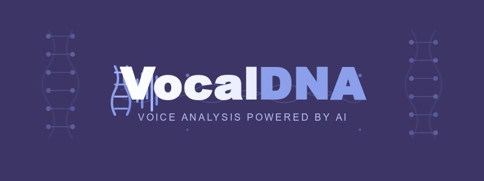

# Madhacks
Project repository for VocalDNA - Madhacks 2025.

Inspiration:
We were inspired by 2010 etsch era websites that functioned off of one neat ability that it had. In this case it is a website that allows you to see whether or not your voice actually matches your DNA (physical appearance) which is pretty neat.

What it does:
This website is a website that allows you to see whether or not your voice actually matches how you look. It comes with a live transcription and an audio file to play back how you sound, and obviously it also comes with the prediction.

How we built it:
We trained python code off of a previously existing database: https://www.kaggle.com/datasets/rtatman/speech-accent-archive and had it determine whether the voices the frontend sent it matched a particular accent or age range.

Challenges we ran into:
The main challenge we ran into was training the code off the database, when we first did it the accuracy we were getting was .09% which is obviously bad and the it took us hours to train it once. Once we optimized it we were able to get upwards of 44% accuracy and it was able to train in about 30 minutes.

Accomplishments that we're proud of:
The best accomplishment that we are proud of us actually being able to train off of a dataset. We've never actually taken any machine learning or data science class which forced us to learn a lot about how the process actually worked.

What's next for VocalDNA:
The obvious next step would be finding a proper dataset to train with. The current one we are using has some issues with its formatting, affecting the confidence of our age prediction the most.
